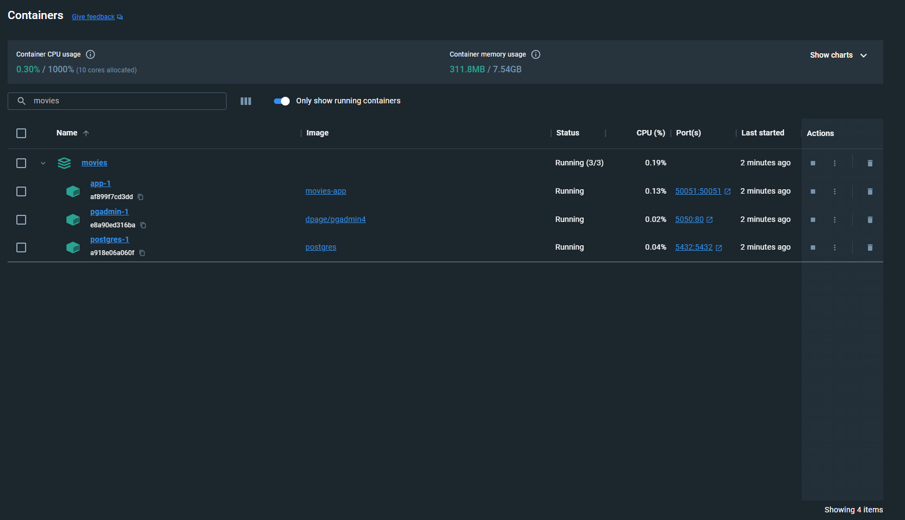

# Movies

## Overview

This is a service for gitting the latest movies from IMDB API, feed the database with the latest movies and expose it throgh a gRPC connection. This service fetches a new movie from IMDB every 3 seconds and if the latest movie is not exists in the database it will insert it into the database.

## Features

1. ✅ Integration with IMDB API, with fetching with help of a cron job that runs every 3 seconds and feeding the database with the latest movies
2. ✅ GetLatestMovies
    * extensive details of the latest movie
3. ✅ SearchMovies
    * by title 
    * by description
    * by released_date
4. ✅ UpdateFavourites
    * add to favorites list
    * remove from favorites list
5. ✅ GetMovieDetials
    * id
    * title
    * description
    * poster
    * genres
6. ⌛ Authentication
7. ⌛ Proper Logging
8. ⌛ Localized Error Messages

## Prerequisites

1. Golang go 1.20.7 or higher
    * https://go.dev/doc/install
2. Protocol Buffer Compiler
    * https://grpc.io/docs/protoc-installation
3. Docker
    * https://docs.docker.com/engine/install
4. Access Token Auth (You need to get a one from IMDB API)

## Notes

### Using TMDB with Postam

If you are used to postamn "like me :)" then you can find there api here:
* https://www.postman.com/devrel/workspace/tmdb-api/overview

You can just simply fork it and use it directly from postman 😎

### Important commands to compile the protocol buffers

You have to compile the protocol buffers every time you change the pf :)

```sh
$ cd movies # you should be in the root directory before executing the below commands 👇
$ export PATH="$PATH:$(go env GOPATH)/bin"
$ protoc --go_out=. --go_opt=paths=source_relative --go-grpc_out=. --go-grpc_opt=paths=source_relative grpc/proto/movies.proto

```

## Fill the ".env" file (if you run it locally) with your own settings

```
DB_HOST=
DB_USER=
DB_PASSWORD=
DB_NAME=
DB_PORT=
ACCESS_TOKEN_AUTH=
```

## Use the following ".env" file (if you run it using the provided docker & docker-compose)

```
DB_HOST=postgres
DB_USER=movies
DB_PASSWORD=movies
DB_NAME=movies
DB_PORT=5432
ACCESS_TOKEN_AUTH=fOrSEcUrItyREaSoNs
```

## How to run?

```
$ mv .env.example .env
$ sudo chmod -R 777 postgres_data
$ docker-compose up
```

## Containers Digram

[](./assets/containersDigram.svg)


## Fetched Movies Into the PostgreSQL Database


[](./assets/runningContainers.png)

## Running Containers

[](./assets/runningContainers.png)


## Fetching and Storing Movie Logs

[](./assets/fetchingAndStoringMovie.png)


## What After?

1. You need to login into pgadmin and then create a server and this server must match the postgres container name, because the name of the container is in fact the host :)

## How to consume the gRPC API endpoints?

1. Method 1: You can consume these gRPC API endpoints by the client CLI

```sh
$ cd movies
$ go run grpc/client/client.go

1: Get latest movies
2: Search movies
3: Update Favorites
4: Get movie details

$ Enter a number (1-4): 
```

2. Method 2: You can consume these gRPC API endpoints by importing the "movies/grpc/proto/movies.proto" to the postman then you can test them!

[](./assets/gRPCEndpoints.png)

## Resources that can help you to understand how gRPC works

I find these resources are good to understand how gRPC works in general :)

1. (An Introduction to Programming in Go) https://www.golang-book.com/books/intro 
2. (Introduction to gRPC) https://grpc.io/docs/what-is-grpc/introduction
3. (gRPC Introduction) https://www.youtube.com/watch?v=XRXTsQwyZSU